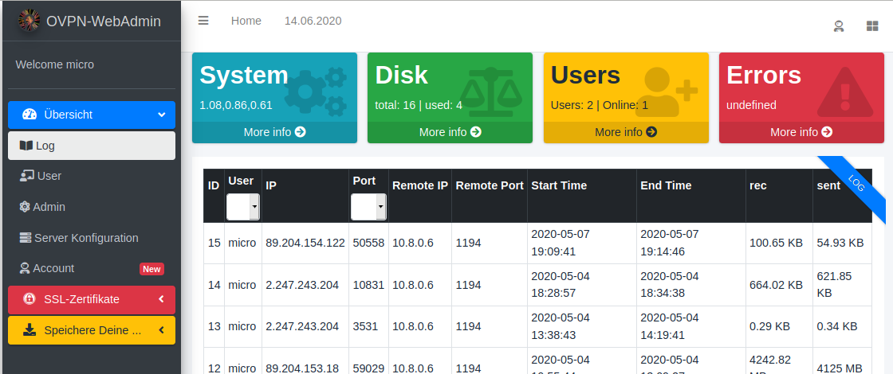
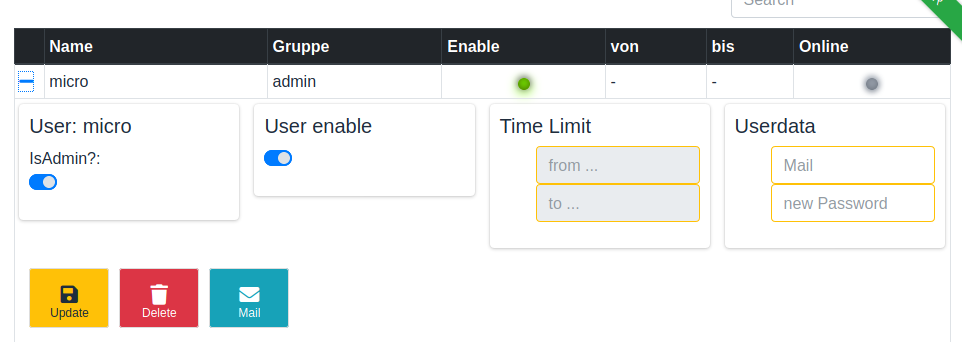

# OpenVPN WebAdmin

Maintainer


## Extended documentation

read please first:


## Summary

Administrate its OpenVPN with a web interface (logs visualisations, users managing...) with MariaDB.





## Prerequisite

* GNU/Linux with Bash and root access
* Fresh install of OpenVPN
* Web server (NGinx, Apache...)
* MariaDB (see note MySQL)
* PHP >= 7.x with modules:
  * zip
* yarn
* unzip
* wget
* sed
* curl
* git
* net-tools (route)

## Note MySQL

If you already have a database server, you can also use this one and do not need to install one locally. You only need a database and a username and password

### Debian 10 Buster

### Raspberry Pi with Debian 10 Buster

### Ubuntu 20.04 Server

## Manual Install with MySQL-Server

````bash
apt-get install openvpn apache2 php-mysql mariadb-server php-zip php unzip git wget sed curl net-tools -y
apt-get install npm nodejs -y
npm install -g yarn
````

## Manual Install without MySQL-Server

````bash
apt-get install openvpn default-mysql-client apache2 php-mysql php-zip php unzip git wget sed curl net-tools -y
apt-get install npm nodejs -y
npm install -g yarn
````

## Tested on

* Debian 10/Buster, PHP 7.3.x, 10.3.22-MariaDB.
* RaspberryPi 4 with Debian Buster
* ~~Ubuntu 20.04 Server (Minimal Installation + OpenSSH-Server)~~

Feel free to open issues. <https://github.com/Wutze/OpenVPN-WebAdmin/issues>

## Installation

* Setup OpenVPN and the web application:

````code
        cd /opt/
        git clone https://github.com/Wutze/OpenVPN-WebAdmin openvpn-admin
        cd openvpn-admin
        cp config.conf.sample config.conf

        Edit your config.conf e.g. with nano
        nano config.conf

        Beginn main installation
        ./install.sh
````

* Setup the web server (Apache, NGinx...) to serve the web application. Using the example below.

````code
        nano /etc/apache2/sites-enabled/[ apache config ]
````
  
* You must reboot the server after installation, otherwise the vpn server will not start correctly and no connection will be established!

* Finally, create a port forwarding on your Internet Router to this VPN-Server. Check the documentation of the router manufacturer or search the Internet for instructions.

## OpenVPN-Clients and Documentation to install

### Apple iOS

* <https://apps.apple.com/us/app/openvpn-connect/id590379981>
* Documentation (German) <https://www.thomas-krenn.com/de/wiki/IOS_11_als_OpenVPN_Client_konfigurieren>

### Android

* <https://play.google.com/store/apps/details?id=de.blinkt.openvpn&hl=de>
* Go to download, download the zip file, unzip it into a separate folder, open the OpenVPN app and download the client.conf. Everything else happens automatically. Enter the password and you are ready to go.

### Windows 10

* <https://openvpn.net/client-connect-vpn-for-windows/>

The full functionality of OpenVPN under Windows 10 can unfortunately only be achieved by running the program under admin rights. This applies in particular to the routing into the VPN network, which does not work without admin rights. Additionally, the client version 3 of OpenVPN is in my opinion not usable to its full extent. For this reason I recommend, especially for people who want to know what they are doing and also want to adjust the configuration, the old version 2. Here is the direct link. <https://openvpn.net/downloads/openvpn-connect-v2-windows.msi>

### all

* Looks at the configuration of the VPN app. If necessary, adjust the address of your gateway to the VPN server. Most routers can handle a free Dyn-DNS, so you only have to give the name, no IP address.

## Apache Example

````conf
<VirtualHost *:80>

        ServerAdmin webmaster@localhost
        DocumentRoot /srv/www/openvpn-admin

        ErrorLog ${APACHE_LOG_DIR}/error.log
        CustomLog ${APACHE_LOG_DIR}/access.log combined

AccessFileName .htaccess
<FilesMatch "^\.ht">
        Require all denied
</FilesMatch>

<Directory /srv/www/openvpn-admin/>
        Options Indexes FollowSymLinks
        AllowOverride all
        Require all granted
</Directory>

</VirtualHost>

````

### Changes from the original (fixes from original issues)

* Support use of Mysql on different server #49
* Can it change bower to Yarn #155
* All other entries are not very helpful for the functions. However, some have been changed in this way, as you can now modify the server.conf within the system.

## Use of

* [admin-lte](https://adminlte.io/)
* [Bootstrap](https://github.com/twbs/bootstrap)
* [Bootstrap Table](http://bootstrap-table.wenzhixin.net.cn/)
* [Bootstrap Datepicker](https://github.com/eternicode/bootstrap-datepicker)
* [JQuery](https://jquery.com/)
* [X-editable](https://github.com/vitalets/x-editable)
